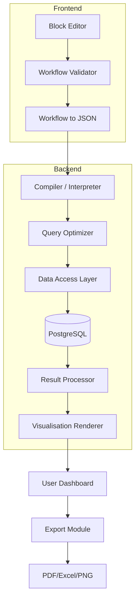

# Aam Aadmi Analytics

**No‑Code Data Visualization Platform for Government Officers**  
*Democratising Aadhaar data insights with drag‑and‑drop simplicity.*

[](https://en.wikipedia.org/wiki/India)
[](https://uidai.gov.in)
[](https://github.com/)


---

## 📋 Table of Contents
- [Overview](#overview)
- [Problem Statement](#problem-statement)
- [Solution: Aam Aadmi Analytics](#solution-aam-aadmi-analytics)
  - [Key Features](#key-features)
  - [How It Works](#how-it-works)
- [Technical Architecture](#technical-architecture)
  - [Frontend](#frontend)
  - [Backend](#backend)
  - [Data Layer](#data-layer)
  - [Security & Privacy](#security--privacy)
- [Component Deep Dive](#component-deep-dive)
  - [1. Block Library](#1-block-library)
  - [2. Block Compiler / Interpreter](#2-block-compiler--interpreter)
  - [3. Visualization Engine](#3-visualization-engine)
  - [4. Export Module](#4-export-module)
- [Usage Guide](#usage-guide)
  - [Example 1: First‑Time Voter Analysis](#example-1-firsttime-voter-analysis)
  - [Example 2: Migration Pattern Detection](#example-2-migration-pattern-detection)
  - [Example 3: Elderly Service Gap Analysis](#example-3-elderly-service-gap-analysis)
- [Pathways Framework](#pathways-framework)
- [Deployment / Installation](#deployment--installation)
- [Technologies Used](#technologies-used)
- [Contributing](#contributing)
- [License](#license)
- [Acknowledgements](#acknowledgements)

---

## 🧭 Overview

**Aam Aadmi Analytics** is a groundbreaking no‑code platform built specifically for Indian government officers working with Aadhaar enrolment, demographic update, and biometric update datasets. Inspired by the visual programming paradigm of **Scratch**, it allows users to construct complex data analyses by simply dragging, dropping, and connecting pre‑defined **blocks** — no coding, SQL, or statistical knowledge required.

The platform is designed with **Indian government realities** in mind: low technical literacy among field staff, multi‑language requirements, and strict data privacy norms. It transforms raw Aadhaar data into actionable insights in minutes, enabling evidence‑based decision‑making at every administrative level.

---

## ❗ Problem Statement

- **85% of government employees** lack technical skills to analyse data.
- **Average wait time** for a custom report from IT departments: **3 weeks**.
- **Data underutilisation**: Only 15% of collected Aadhaar data is ever analysed, despite its potential to improve service delivery.
- **Tool complexity**: Tools like PowerBI/Tableau require expensive licences and extensive training.
- **Language barrier**: Most analytics tools are English‑only, excluding Hindi and regional language speakers.

**Result**: Valuable insights remain locked in spreadsheets, slowing down governance and welfare delivery.

---

## 💡 Solution: Aam Aadmi Analytics

Aam Aadmi Analytics bridges the gap with an intuitive, block‑based visual interface.

### Key Features

- **🧩 Drag‑and‑Drop Blocks** – No coding required. Six categories of blocks cover everything from data input to visualisation.
- **🌐 Multi‑Language Support** – Interface available in Hindi and English (architecture ready for 12 regional languages).
- **📊 Rich Visualisations** – Bar charts, pie charts, line graphs, choropleth maps, Sankey diagrams, heatmaps, and more.
- **🔒 Privacy by Design** – Minimum threshold (20 records) prevents re‑identification; role‑based access controls; full audit logs.
- **🚀 Instant Results** – Analyses that once took weeks now complete in minutes.
- **📁 Export Options** – PDF reports, Excel sheets, PNG images, and shareable links.
- **📚 Template Library** – 50+ pre‑built analyses for common government use cases.


### How It Works

The user builds a **workflow** by connecting blocks. For example:

```text
[Enrolment Data] → [Filter: Age > 18] → [Filter: State = "HP"] → 
[Group by District] → [Count] → [Show as Map]
```

Behind the scenes, the platform compiles this visual sequence into an **optimised SQL query**, executes it against the Aadhaar database, and renders the result as a choropleth map.

---

## 🏗️ Technical Architecture



### Frontend
- **Block Editor**: Built with Google’s [Blockly](https://developers.google.com/blockly) library. Users drag blocks from a palette onto a canvas.
- **Localisation**: React‑based UI with i18n support. All block labels, help text, and error messages are translated dynamically.
- **Real‑time Validation**: The editor checks for logical errors (e.g., filtering by a non‑existent column) and provides contextual suggestions.

### Backend
- **Compiler**: Converts the JSON workflow into an abstract syntax tree (AST), then generates optimised SQL.
- **Query Optimizer**: Applies indexing hints, caching strategies, and query rewriting for performance.
- **Data Access Layer**: Manages database connections, connection pooling, and transaction safety.
- **Result Processor**: Transforms raw query results into a format suitable for visualisation (e.g., GeoJSON for maps).
- **Visualisation Renderer**: Uses [Plotly](https://plotly.com/) and [D3.js](https://d3js.org/) to generate interactive charts on the server or client side.

### Data Layer
- **PostgreSQL** with **PostGIS** extension for geospatial queries.
- **Redis** for caching frequent queries and session management.
- **Data Partitioning**: Aadhaar datasets are partitioned by region and time to speed up queries.

### Security & Privacy
- **Role‑Based Access Control** (RBAC): Users see only data permitted by their role.
- **Minimum Threshold Suppression**: Any result set with fewer than 20 records is automatically masked.
- **Audit Logging**: Every block sequence, query, and export is logged for accountability.
- **Encryption**: Data encrypted at rest and in transit (TLS 1.3).

---

## 🔍 Component Deep Dive

### 1. Block Library

Six categories of blocks, each with a distinct visual style and function:

| Category          | Example Blocks                                      | Description                                                                 |
| ----------------- | --------------------------------------------------- | --------------------------------------------------------------------------- |
| **Data Source**   | `Enrolment`, `Demographic Updates`, `Biometric Updates` | Connect to the three Aadhaar datasets.                                      |
| **Filter**        | `State = ...`, `Age > ...`, `Date between ...`      | Restrict data based on conditions.                                          |
| **Transform**     | `Group by`, `Calculate (Count/Sum/Avg)`, `Join`     | Aggregate, compute, or combine datasets.                                    |
| **Analysis**      | `Trend line`, `Correlation`, `Anomaly detection`    | Statistical and predictive operations.                                      |
| **Visualisation** | `Bar chart`, `Map`, `Sankey diagram`, `Heatmap`     | Choose how to display the results.                                          |
| **Output**        | `Export PDF`, `Share link`, `Schedule report`       | Finalise and distribute the analysis.                                       |

### 2. Block Compiler / Interpreter

The compiler is the brain of the platform. It performs the following steps:

1. **Parsing**: The JSON workflow is parsed into an internal AST.
2. **Semantic Validation**:
   - Data types match (e.g., filtering a numeric column with a string).
   - Joins are logically possible (foreign keys exist).
   - Privacy thresholds are respected.
3. **Optimisation**:
   - Push filters down as early as possible.
   - Use appropriate indexes.
   - Cache intermediate results if reusable.
4. **Code Generation**:
   - Produces a parameterised SQL query.
   - Optionally generates equivalent Python/Pandas code for debugging.
5. **Execution**:
   - Executes the query through the data access layer.
   - Returns results as a DataFrame.
  


### 3. Visualization Engine

- **Server‑side rendering** for static exports (PDF, PNG).
- **Client‑side rendering** for interactive dashboards (zoom, pan, tooltips).
- Supports **choropleth maps** (India state/district boundaries), **Sankey diagrams** for migration flows, and **time‑series charts**.
- Built on Plotly and D3.js.


### 4. Export Module

- **PDF**: Generates a report with the visualisation and a summary table.
- **Excel**: Exports raw data for further manipulation.
- **PNG**: Captures a snapshot of the visualisation.
- **Shareable link**: Creates a permanent link (with access controls) for collaboration.

---

## 🧑‍💻 Usage Guide

### Example 1: First‑Time Voter Analysis

**Goal**: Identify districts in Himachal Pradesh with the highest number of people turning 18 this year.

**Workflow**:

```text
[Enrolment Data] 
    → [Filter: Age = 18] 
    → [Filter: State = "HP"] 
    → [Group by: District] 
    → [Count] 
    → [Show as: Bar Chart]
```

**Result**: A bar chart showing district‑wise first‑time voters.  
**Export**: PDF report for district magistrates.

---

### Example 2: Migration Pattern Detection

**Goal**: Visualise migration from Bihar to Delhi over the last 12 months.

**Workflow**:

```text
[Demographic Updates] 
    → [Filter: Update Type = "Address Change"] 
    → [Filter: Date > last 12 months] 
    → [Extract Source and Destination Pincodes] 
    → [Count by Source‑Destination] 
    → [Show as: Sankey Diagram]
```

**Result**: A Sankey diagram showing the volume of migration.  
**Insight**: Plan resources for migrants in Delhi.

---

### Example 3: Elderly Service Gap Analysis

**Goal**: Find districts where elderly (>60) have low biometric update rates (likely need mobile vans).

**Workflow**:

```text
[Enrolment Data] 
    → [Filter: Age > 60] 
    → [Join with Biometric Updates on District] 
    → [Calculate: Update Rate = Updates / Enrolments] 
    → [Filter: Update Rate < 30%] 
    → [Show as: India Map (red districts)]
```

**Result**: A map highlighting underserved districts.  
**Action**: Deploy mobile biometric vans.

---

## 🌐 Pathways Framework

Our project is designed as a systemic intervention across six interconnected pathways:

| Pathway          | Goal                                                                 |
| ---------------- | -------------------------------------------------------------------- |
| **Technical**    | Build a scalable, intuitive, and secure platform.                    |
| **Behavioral**   | Drive adoption through peer champions and success stories.           |
| **Capacity**     | Empower officers with data skills via multi‑language, contextual help.|
| **Policy**       | Align with privacy laws and create governance frameworks.            |
| **Institutional**| Break silos between departments through shared analytics.            |
| **Social**       | Ensure every insight translates into citizen benefit.                |

Each pathway feeds back into the others, creating a virtuous cycle of continuous improvement.

---

## 🚀 Deployment / Installation

**Prerequisites**:
- Docker & Docker Compose
- PostgreSQL 13+ with PostGIS
- Node.js 18+ (for frontend development)
- Python 3.10+ (for backend)

**Quick start**:
```bash
git clone https://github.com/aamaadmi-analytics/aadhaar-viz.git
cd aadhaar-viz
docker-compose up -d
```

---

## 🛠️ Technologies Used

| Area          | Technologies                                                                 |
| ------------- | ---------------------------------------------------------------------------- |
| **Frontend**  | React, Blockly, i18next, Plotly, D3.js, Mapbox GL                           |
| **Backend**   | Python (FastAPI), SQLAlchemy, Pandas, NumPy, Statsmodels                    |
| **Database**  | PostgreSQL, PostGIS, Redis                                                   |
| **DevOps**    | Docker, Kubernetes (optional), GitHub Actions                                |
| **Security**  | OAuth2, JWT, RBAC, encryption (AES‑256), audit logging                      |
| **Languages** | English, Hindi (extensible to 12 regional languages)                         |

---

## 🤝 Contributing

We welcome contributions from the open‑source community.

- **Report bugs**: Open an issue with the `bug` label.
- **Suggest features**: Use the `enhancement` label.
- **Translate**: Help us add more Indian languages via our translation platform.

---

## 📄 License

This project is licensed under the **MIT License**

---

## 🙏 Acknowledgements

- **UIDAI** for providing the datasets and organising the hackathon.
- **R.K. Laxman** for inspiring the “Common Man” comic strip that helped us visualise our users.
- **Google Blockly** team for the amazing visual programming library.
- All the government officers who shared their data challenges with us.

---

> *“जब हर कर्मचारी बन सकता है डेटा विशेषज्ञ, तब हर नागरिक पाएगा बेहतर सेवाएं।”*  
> *(When every employee can become a data expert, every citizen gets better services.)*

**Made with ❤️ for India**
